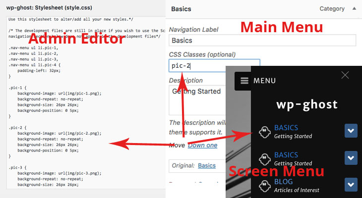
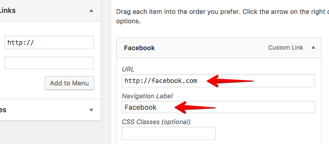
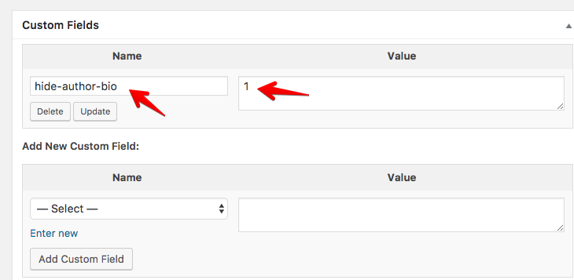
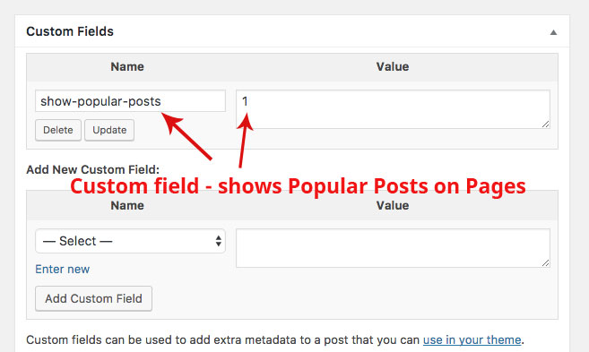

# Welcome to wp-ghost

## Nothing transparent about this theme

A _no thrills_, _down to earth_ theme based on the **Casper** theme from the popular **Ghost** blogging platform. This theme is built for _blogging_ with a _simple design_ and _very user-friendly fonts_ which makes _easy reading_.

### Development

Although the theme is ready to use, the development files are still in place, _eg scss files_ for you to alter to make the theme to your liking.

### Theme Preview
[howardl.uk](https://howardl.uk) uses __wp-ghost__ via a _child theme_

### Custom CSS

Use the editor to add your user css styles to the style.css.

#### Navigation Icons

You will notice styles relating to the navigation icons in style.css. If you add classes _pic-1_, _pic-2_ etc, to the main navigation menu css classes section (_you may have to enable 'css classes' via 'Screen Options'_), you will see default icons loaded from the _theme image_ folder.

To set your own icons, save your icons to a folder (_use any image format_), and change the path to your _icons folder_.

_Set a nice large image for 2x devices eg 100px x 100px_. It is easier if you name your icons _pic-1_, _pic-2_ etc, if not make sure you change the styles below to suit your image. You may have to alter _size_ and _position_ to match your icons.

```
.pic-1 {
    background-image: url(img/pic-1.png);//change this path to suit yours
    background-repeat: no-repeat;
    background-size: 26px 26px;
    background-position: 0 5px;
}
```

If you have a problem viewing your new styles try _clearing the browser data_.



### Fonts

The theme uses the following fonts:

- Bookerly - _seen on the Kindle Apps_
- Merriweather Sans - _for the headings_
- Source Code - _For the code_
- FontAwesome - _Icons_

### Highlight Code

The theme uses _highlight.js_, an alternative to _google code_. More information can be found on the [highlight](http://highlightjs.org/) website.

### Header Images

The header images on the _home page_, _posts page_ and _normal pages_ _eg. Categories_, are all background images. Set large images about _1200 x 700_ for 2x devices. You may have to experiment with your images for best fit, give your images **plenty** of room top and bottom.

### Page Templates

The theme has a couple of page templates if you wish to use them:

#### Sitemap

Enable this page via the _page templates_ when making a new page. Add some content _eg a sitemap introduction_, add a _post thumbnail_ if you wish. When viewed the page should show all your _posts_, _pages_, _categories_ etc. This sitemap is a _user friendly quick access to your site links_ and is not a substitute for a _search engine xml sitemap_, which are usually created via a plugin eg._'Yoast SEO'_.

#### Start Page

This page is based on the _index/front_ page _ie_ it has the same _header_ with _site title and description_. This can be used as a _new home page_.

### There are no Tags

Following _Ghost_ there are no tags, (_Ghost actually has tags but no categories_). The theme only has _categories_ with the option of loading a background image for your _category_ page from the _admin_ section.

### The Author Page

Again, _following Ghost_, you can set an image for the _Author page background_ in the _Profile_ area of the _admin_ section.

### Social icons

Set the _social icons_ in the _menus_ section, the icons appear in the footer(_bottom, right_) and in the sidebar(_under the menu_).



Font Awesome 4.6.3 used for the icons  
_icons used:_

behance.net  
codepen.io  
digg.com  
dribbble.com  
dropbox.com  
facebook.com  
flickr.com  
foursquare.com  
plus.google.com  
github.com  
instagram.com  
linkedin.com  
pinterest.com  
reddit.com  
stumbleupon.com  
tumblr.com  
twitter.com  
vimeo.com  
wordpress.com  
wordpress.org  
youtube.com  
mailto:  
spotify.com  
twitch.tv  
path.com  
skype.com  

Try adding any missed icons to the style.css using the code below

    a[href*="skype.com"]:before {
        content: "\f17e"; }

### Hide Author Biography

The _Author Bio_ appears at the bottom of posts by default. To alter this set a _custom field_ to _hide-author-bio_ set to the value of **1**. The code on the single page will hide the Author Biography.

.

### Show Popular Posts on Pages

To show popular posts on pages set a _custom field_ to _show-popular-posts_ set to the value of **1**.

.

### Post Images

The post images don't use the _alignleft, alignright, aligncenter_ and _alignnone_. The images are set to be centred so try and use the full width if possible for more effect.

### Custom Logo
The _custom logo_ replaces the top heading in the sidebar when enabled via _Appearance - Customise - Site Identity_.

### Post Content

The post content is 710px wide

### Problems

If you have any problems or find bad code please let me know. It would be much appreciated.<br>
[email me](mailto:howard@howardl.co.uk) or [Use the Contact Form](https://goo.gl/forms/nqkL70178cFAk0nt1)

### And Finally

Download the latest _wp-ghost_ theme version from [here](https://github.com/bylucas/ghost-wordpress)

View _wp-ghost_ and more information [here](https://howardl.uk/themes/wp-ghost-wordpress-theme/)